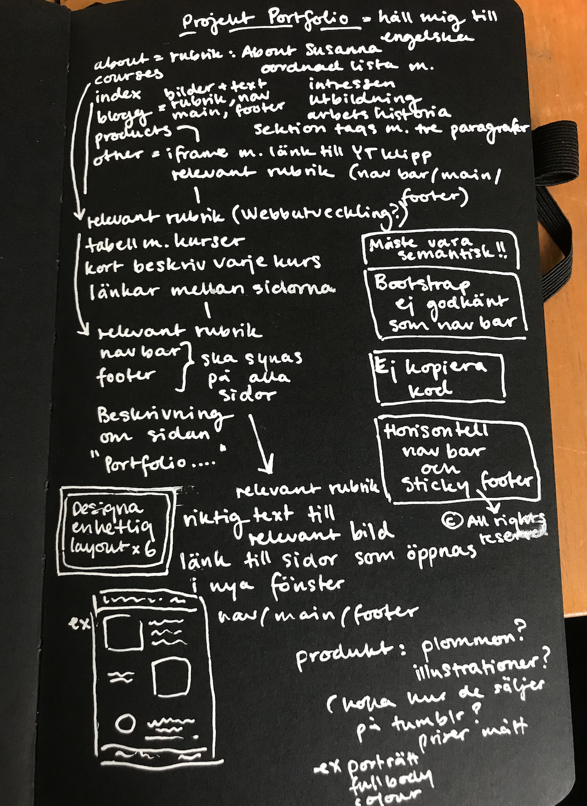
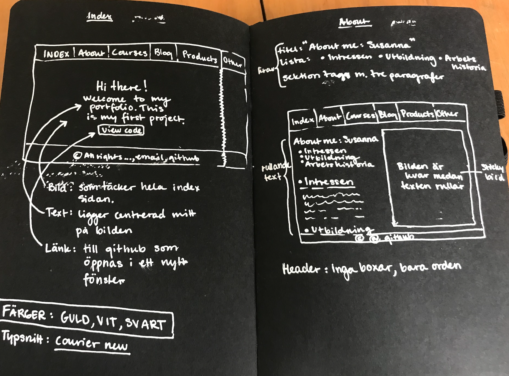
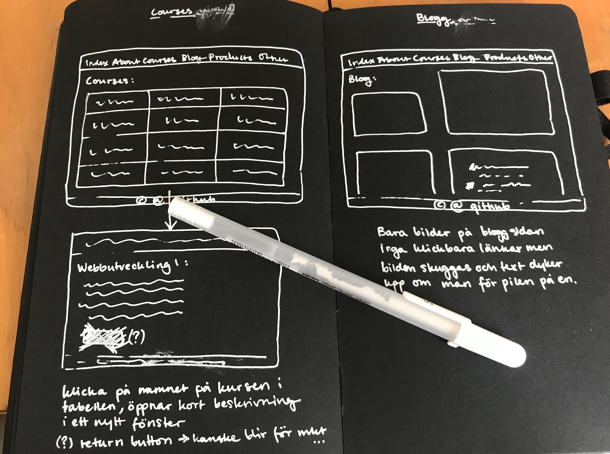
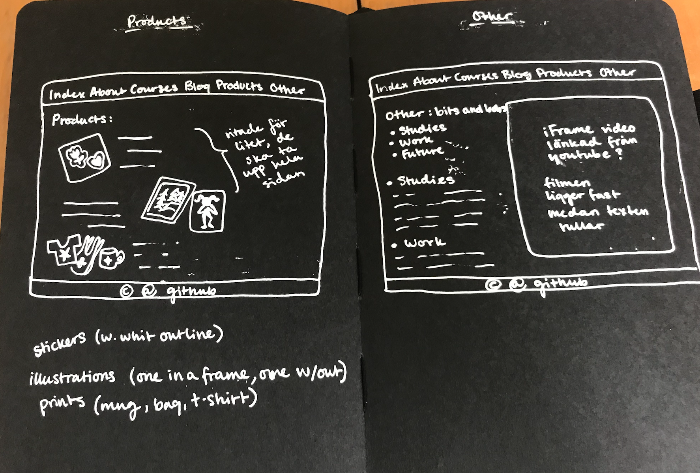

# Projektplan och dokumentation

## Förberedelser och planering

Jag började projektet med att anteckna grovt vad som skulle vara med i portfolion.

Sen skissade jag en plan på hur jag ville att sidan skulle se ut. Tog lite inspiration
från [Patrycja Podkościelny](http://podkoscielny.com "Patrycja Podkościelny")
för färgtemat till sidan. Om mig sidan ville jag skulle se ut lite som
[Evangeline Gallagher](https://www.evangelinegallagher.com/about "Evangeline Gallagher")s om mig sida. När det gäller
fonts så har jag alltid gillat Courier new så det ville jag ha som första val på all text.

När det kom till table med kurserna så tänkte jag initialt att jag ville ha varje ruta som en länk till ett nytt fönster
med information om den specifika kursen. I slutänden kändes det som det blev lite mycket så jag sparar det till ett
annat projekt, hade varit kul att testa hur det funkar när jag känner att jag har mer tid. Själva blog sidan hade jag
först tänkt att ha som ett galleri. Flera bilder i olika storlekar och med text som dyker upp när man hover med pilen på
dem. Återigen kändes det som att jag inte riktigt hann sätta mig in i det och gjorde i slutänden ett mer traditionellt
blogginlägg med två bilder, datum och en längre text.

Produkt sidan var bland den svåraste att göra men gick snabbt att komma på vad jag ville ha som själva produkten, olika
merch med mina illustrationer på. Till nästa gång hade det dock varit roligt att ha min mammas keramik som produkt
istället, kom på det efter att jag målat alla bilder och klistrat på den på olika saker... Övrigt eller other sidan var
lite random. Hade en initial plan om att skriva om framtida projekt där men blev i stället en tågvideo och ett citat
från min favorit film.

## Tillvägagångssätt

Eftersom navbar och footer skulle vara med på alla sidor började jag med dem först.

## Tutorials och saker vi gick igenom efter jag försökt göra dem själv

Eftersom vi bara hade genomgång av nya saker på måndagar och tisdagar så blir det ju lätt så att något som betett sig 
problematiskt eller varit svårt att hitta lösningen på får sitt svar under lektionen.

## Lättläst, responsiv och fungera på olika enheter

Att sidan skulle vara enkel för en talsyntes hade jag i bakhuvudet. När det kommer till kurssidan så blev det väldigt
mycket text och den är inte så lätt att ta sig igenom. Kändes som den blev lite bättre efter att jag skrev allt i punkt
form, jag gjorde även en fuling och kopierade texten från skolverket rakt av. 

Responsiviteten var svår, betydligt svårare än jag hade föreställt mig. Vi gick igenom mobile first ganska sent på kursen
och jag hade designat allt utifrån desktop first så det blev en stor omställning. Här borde jag kanske ha funderat på att
göra ytterligare en plan men jag koncentrerade mig bara på navigations menyn. Jag gjorde en helt ny navigations meny och 
la till den att visas när skärmen är mindre än 678px. Det blev helt okej. Den fungerade inte riktigt som jag ville när 
jag använde "Inspektera" fönstret i Firefox. Då hoppade drop-down meny upp ett snäpp så att index och about hamnade 
utanför skärmen men inte om jag gjorde det i Safari eller Chrome. Fortfarande osäker på varför det sker, jag har inte 
lyckats rätta till det. Jag hade möjligheten att låna en test domän av min pappa och då såg menyn helt okej ut på mobilen 
i mobilläget i Firefox iallafall. Produktsidan var lite klurig men fick ordning på att bild och text ligger sida 
vid sida i desktop läge och under varandra i mobilläge. Den sista sidan som jag hade intresse av att ändra utseende i 
mobilläge var kurs sidan. Det blir ett problem att se över när jag har tid, om det går att lägga in en table i grid eller
flexbox. Det hade varit snyggt om den i mobilläge gick att lägga HT21, VT22 och HT22 under varandra men i nuläget så styr 
table mycket av utseendet på sidan i mobilläge. Menyn blir mindre och ligger mer till vänster, ej centrerat, och text 
mycket smalare och lägger sig också till vänster. Det känns lite halvfärdigt men det går iallafall att se hela sidan. 

När det gäller olika webbläsare så tror jag att fastnade lite i att bara använda Chrome. Jag började väldigt sent med att
kolla responsiviteten i olika webbläsare. I Chrome och Safari såg allt likadant ut men Firefox betedde sig inte alls på
samma sätt och det satte bildligt uttryckt käppar i min hjärnas kugghjul. 

## Att tänka på och ta med sig till nästa projekt

Jag lärde mig så mycket under detta projektet och inser att det finns så mycket jag skulle vilja tänka på till nästa
gång. Ganska tidigt insåg jag att jag inte hade så bra ordning i mina dokument och filer men istället för att göra om
från början envisades jag med att röra ihop allt ytterligare. I vissa fall tror jag att jag hade tjänat mer tid på att
ta ett djupt andetag och börja om från början. Kanske inte från noll och inte bara genom att radera allt men att typ
kommentera ut texten och titta lite på dem medan jag skriver nytt. Tror även att det hade varit bra att sätta ett schema
eller ungefärliga tider. Nu blev det ett virrvarr av långa och korta dagar. Ibland satt jag alldeles för länge och ibland
kunde jag nog ha suttit med det lite mer.

Jag försökte tänka på att skicka commits till github ofta men det blev mer och mer sällan under projektets gång. 
Flera gånger när jag fastnade med något glömde jag bort att när det väl löst sig skicka ett commit. Borde också ha lagt 
ner lite mer energi på vad jag skrev i dem. När jag gått tillbaka till dem och läst dem är det bara pinsamt och tydligt
hur jag bara lät frustrerad hela tiden. Det är roligt att sitta med problem och känslan när man ser svaret är obeskrivlig. 

Apropå svar så leder det mig till ytterligare en sak, jag kände att det var så svårt att fråga om hjälp för jag hade 
så svårt att formulera vad det var jag behövde hjälp med.
Vi har ju discord för klassen och alla är så otroligt nyfikna och hjälpsamma. Nästa gång ska jag försöka var mer aktiv
där och våga fråga. Jag kanske till och med kan hjälpa någon annan med något. Det gör så mycket att få några nya ögon på
koden för att se något man själv har missat. Känner att kod inte är så ren som den skulle kunna vara. Vill jobba på det
till nästa gång.

Och till sist, till nästa projekt, vänta inte med all dokumentation till inlämningsdagen.

[Testdomän av min sida](https://mariillustrations.se/index.html "Testdomän")
